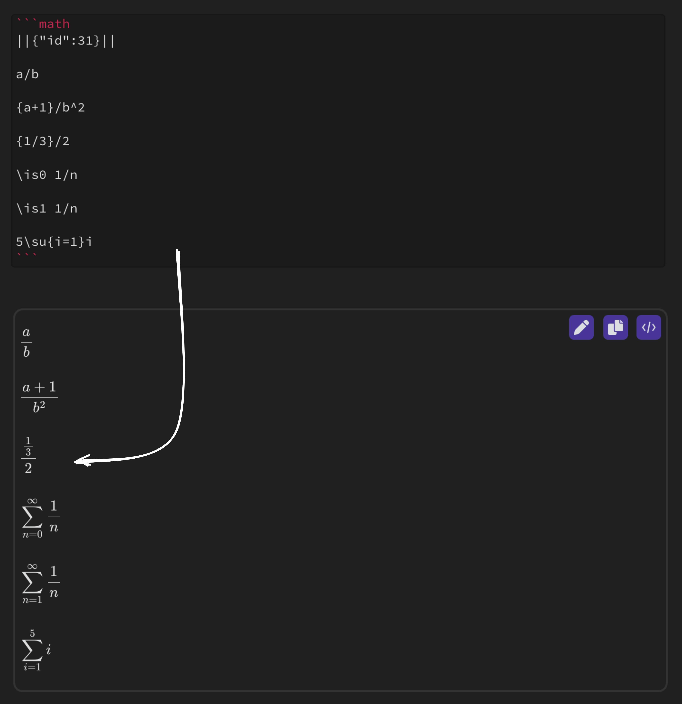

# Obsidian Math+
Obsidian Math+ is a plugin for taking math notes quickly and efficiently.

## Usage
Run the `Insert math block` command, either using the command pallet or `cmd + M`. This will create a math block for you to start taking notes in, you can write these notes using LaTex, or just write the equations out intuitively, and they will be parsed to the best of this plugin's ability.

Now that your notes have been rendered, you can go into draw mode by clicking the pen icon in the top right of the block.
This opens up an [Excalidraw](https://github.com/excalidraw/excalidraw) instance over the math block so you can easily add freeform annotations.

> **Note:** This only works in Live Preview Mode

To save your drawing, press the checkmark in the upper right corner, and your drawing will be rendered as an SVG.

## Settings
**Colors**

Here you can change the three default colors you can pick from while taking notes, or turn on the color picker for customization on the fly.

**Excalidraw UI**

Excalidraw has a lot of drawing tools which you can toggle on or off here based on your needs.

**Excalidraw Settings**

You can toggle grid mode on or off here.

